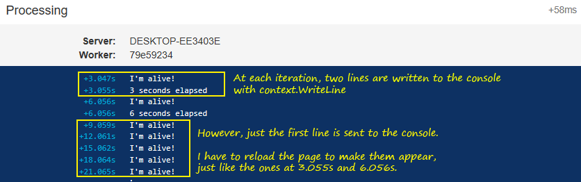

# hangfire-console-issue64-repro
Just run the application, a Hangfire job will be immediately enqueued and processed.
The job code is here: [MyJob.cs](MyJob.cs).

This image describes the issue: not all calls to context.WriteLine will be shown to the console, unless the page is reloaded.
